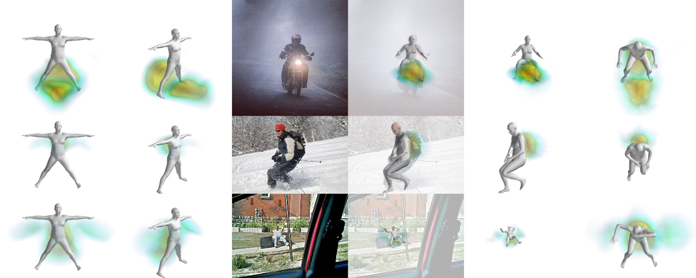
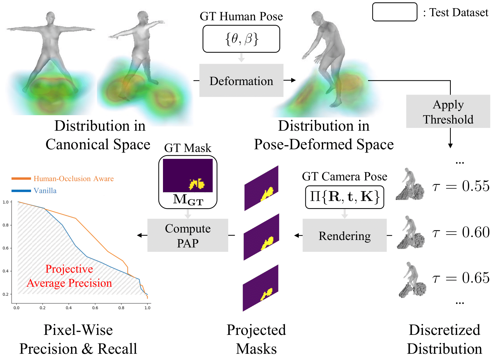

<p>
<h1>CHORUS [ICCV 2023, Oral]</h1>
</p>

[]()&nbsp;&nbsp;
[](https://jellyheadandrew.github.io/projects/chorus)&nbsp;&nbsp;
[](https://arxiv.org/abs/2308.12288)

> [**CHORUS: Learning Canonicalized 3D Human-Object Spatial Relations from Unbounded Synthesized Images**](https://arxiv.org/abs/2308.12288),            
> [Sookwan Han](https://jellyheadandrew.github.io), 
[Hanbyul Joo](https://jhugestar.github.io)    
> *International Conference on Computer Vision (ICCV), 2023*

<br>
<div align="center">

</div>


## News
### Sep 2023
Initial code release, including the codes for *training* and *evaluation*.


## Installation
To set up the necessary environments for running CHORUS, please refer to the instructions provided <a href="INSTALL.md"> here</a>.


## Demo
<div align="center">

</div>
<br>

*Demo colab notebook is coming soon! (eta October 2023)*


## Training
<div align="center">

</div>
<br>

> *NOTE: Current version only supports **<a href="https://cocodataset.org/#home">COCO</a>** & **<a href="https://www.lvisdataset.org/">LVIS</a>** categories.*


### Dataset Generation
CHORUS is trained on a generated dataset of human-object interaction images. Here, we provide an example for running the entire dataset generation pipeline for the `surfboard` category. To create this dataset of images, please activate the appropriate environment beforehand using the following command:
```shell
conda activate chorus_gen
```

---
#### Prompt Generation
CHORUS initially produces multiple HOI prompts for the given category `surfboard` using <a href="https://openai.com/blog/chatgpt">ChatGPT</a>. You can find example prompts for the `surfboard` category under `prompts/demo` directory. If you wish to generate prompts for other categories or create your own, follow the steps outlined below.

1. The OpenAI API relies on API keys for authentication. To generate prompts on your own, it is essential to have access to your own API key. If you don't have one already, please refer to <a href="https://help.openai.com/en/articles/5112595-best-practices-for-api-key-safety">this link</a>.

2. After successfully configuring your API keys, execute the following command:

    ```shell
    python scripts/generation/generate_prompts.py --categories 'surfboard'
    ```

    to generate plausible HOI prompts for the specified `surfboard` category. By default, the results will be saved under the `prompts/demo` directory.

Please note that the OpenAI API does not support random seeding, as mentioned <a href="https://community.openai.com/t/is-there-a-way-to-set-a-a-random-seed-for-responses-with-temperature-0/4164">here</a>; hence, the results of prompt generation are not reproducible. To address this, we also provide the prompts used in our <a href="https://arxiv.org/abs/2308.12288">paper</a> under the `prompts/chorus` directory, as they may not be reproducible.


---
#### Image Generation
To generate the dataset of images from HOI prompts for the `surfboard` category, execute the following command:
```shell
sh scripts/demo_surfboard_gen.sh $NUM_BATCH_PER_AUGPROMPT $BATCH_SIZE   # Default: 20, 6
```
Please note the following details:
- The generation process typically requires around 9~10 hours when running on a single RTX 3090 GPU.
- If you wish to reduce the generation time (i.e., number of generated images), you can consider modifying the `$NUM_BATCH_PER_AUGPROMPT` argument (default: 20).
- In case you encounter a CUDA Out Of Memory (OOM) error, you can alleviate this issue by reducing the batch size. Adjust the `$BATCH_SIZE` argument (default: 6) accordingly.
- To resume the generation process, simply rerun the command. The program will automatically skip existing samples during the process.
- The generated images will be saved under the `results/images` directory by default.


---
### Aggregation (Learning)
Once the dataset generation is complete, CHORUS aggregates the information from images for 3D HOI reasoning. To execute the aggregation pipeline, please activate the appropriate environment beforehand using the following command:
```shell
conda activate chorus_aggr
```
With the generated dataset in place, you can execute the complete aggregation pipeline for the `surfboard` category by running the following command:
```shell
sh scripts/demo_surfboard_aggr.sh
```
Please note the following details:
- To resume the aggregation process, simply rerun the command. The program will automatically skip existing samples during the process.
- After running the command successfully, you can check the visualizations under the `results_demo` directory!

## Evaluation
<div align="center">

</div>

### Preparing the Test Dataset
For quantitative evaluation, we utilize the **extended COCO-EFT** dataset as our test dataset. To set up the test dataset, please follow the steps below.
1. Download the <a href="https://cocodataset.org/#home">COCO</a> dataset and the <a href="https://github.com/facebookresearch/eft">COCO-EFT</a> dataset by running the following command:

    ```shell
    sh scripts/download_coco_eft.sh
    ```
    By default, the <a href="https://cocodataset.org/#home">COCO</a> dataset will be downloaded to the `imports/COCO` directory, and the <a href="https://github.com/facebookresearch/eft">COCO-EFT</a> dataset will be downloaded to the `imports/eft` directory.


2. After downloading the datasets, preprocess and extend the dataset by executing the following command:

    ```shell
    python scripts/evaluation/extend_eft.py
    ```
    This script will prepare the dataset for evaluation.

---
### Reproduce Results
To replicate the results in the <a href="https://arxiv.org/abs/2308.12288">paper</a>, you have two options:
<br>

#### Option 1: Download Pretrained Results

You can download the pretrained results using the following script:
```shell
sh scripts/download_pretrained_chorus.sh
```
This option is recommended if you have limited storage space or want to quickly access the pretrained results.
<br>

#### Option 2: Full Reproduction
> *Note: This process requires at least **5TB** of storage to save the generated results.*

To fully reproduce the results, follow the steps below.

1. Activate the `chorus_gen` environment:

    ```shell
    conda activate chorus_gen
    ```

2. Generate the dataset for all categories used in quantitative evaluation by running:

    ```shell
    sh scripts/run_quant_gen.sh
    ```

    Please note that this step may require significant storage space.

3. Activate the `chorus_aggr` environment:
    
    ```shell
    conda activate chorus_aggr
    ```

4. Aggregate the information from images by running:
    
    ```shell
    sh scripts/run_quant_aggr.sh    
    ```

    Please note that this step may require significant storage space.

---
### Evaluate PAP (Projective Average Precision)
We perform quantitative evaluations for <a href="https://cocodataset.org/#home">COCO</a> categories using the proposed *Projective Average Precision* (PAP) metrics. To compute PAP for the reproduced results, run the following command:
```shell
python scripts/evaluation/evaluate_pap.py --aggr_setting_names 'quant:full'
```
This command will calculate PAP for each category based on the reproduced results. To report the mean PAP (mPAP) averaged over all categories, execute the following command:
```shell
python scripts/evaluation/report_pap.py
```


## Citation
If you find our work helpful or use our code, please consider citing:
```bibtex
@inproceedings{han2023chorus,
  title = {Learning Canonicalized 3D Human-Object Spatial Relations from Unbounded Synthesized Images},
  author = {Han, Sookwan and Joo, Hanbyul},
  booktitle = {Proceedings of the IEEE/CVF International Conference on Computer Vision},
  year = {2023}
}
```


## Acknowledgements
1. Our codebase builds heavily on 
    - <a href="https://github.com/vchoutas/smplx">SMPL/SMPL-X</a>
    - <a href="https://github.com/facebookresearch/frankmocap">Frankmocap</a>
    - <a href="https://github.com/jby1993/SelfReconCode">SelfRecon</a>
    - <a href="https://github.com/CompVis/stable-diffusion">Stable Diffusion</a>
    - <a href="https://github.com/facebookresearch/eft">EFT</a>
    - <a href="https://github.com/facebookresearch/detectron2">Detectron2</a>
    - <a href="https://github.com/open-mmlab/mmpose">MMPose</a>
    - <a href="https://github.com/Meshcapade/wiki">Meshcapade wiki</a>
    
    Thanks for open-sourcing!

2. We thank <a href="https://bjkim95.github.io/">Byungjun Kim</a> for valuable insights & comments!


## License
This work is licensed under a <a href="https://creativecommons.org/licenses/by-nc-sa/4.0/">Creative Commons Attribution-NonCommercial-ShareAlike 4.0 International License</a>. However, please note that our code depends on other libraries (e.g., <a href="https://smpl.is.tue.mpg.de/">SMPL</a>), which each have their own respective licenses that must also be followed.